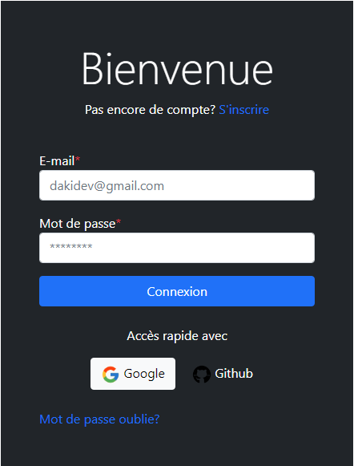

# Login page with HTML/CSS

## Welcome! 👋

Already thanks for your comment about my work.

**To do create this page, you need a basic understanding of HTML and CSS.**

## To get an overview

Doest not exist to click on the link below in order to be able to browse the different existing pages 👇:

- [To visit](https://dakidev.github.io/Login-form/)
